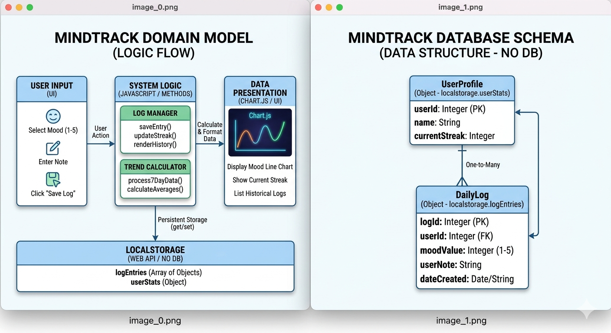

# MindTrack Wellness 🌿

**MindTrack** is a minimalist daily mood journal that lowers the barrier to mental health tracking through a simple 1-5 mood logger and intuitive weekly visualizations.

## 📖 Project Documentation
* **[Team Agreement](team-agreement.md)**
* **[Software Requirements](./requirements.md)**
* **[Wireframes & Design Specs](./wireframes.md)**

## 🚀 Key Features (MVP)
* **Daily Mood Logger:** 1-5 scale with an optional short note.
* **Mood Trends:** A 7-day visualization of mood fluctuations using Chart.js.
* **Persistence:** All data is saved on your device using LocalStorage.

## 📊 Domain Model & 🗄️ Database Schema
The diagram below represents the Logic Flow and Data Structure for MindTrack.

## 📋 Project Management
* **[GitHub Project Board/Issues](https://github.com/orgs/mindtrack-wellness-group/projects/2/views/1)**
