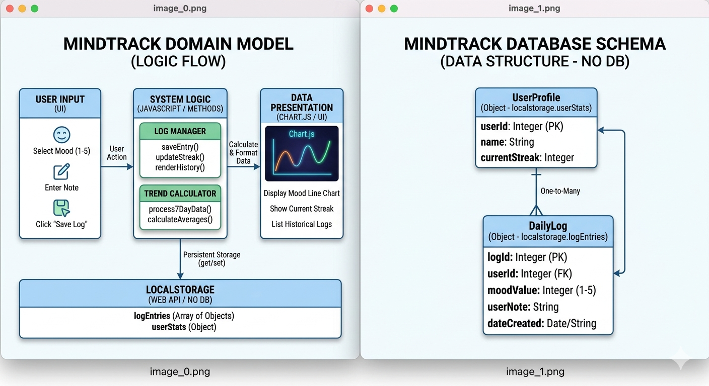

# MindTrack Wellness 🌿

MindTrack is a minimalist daily wellness journal and mood tracker designed to lower the barrier to mental health awareness. By combining simple 1-5 mood logging with intuitive visualizations, MindTrack allows users to identify emotional patterns through data-driven self-reflection—all while keeping data private on the user's local device.

## 📖 Project Documentation
* **[Team Agreement](team-agreement.md)**
* **[Software Requirements](./requirements.md)**
* **[Wireframes & Design Specs](./wireframes.md)**
* **[Presentation Slides](https://docs.google.com/presentation/d/165UGLGMK0UCZ6QIzSpoOTPg1BOxI6G7n3yMhwaDeGJM/edit?usp=sharing)**

## 🚀 Key Features (MVP)
* **Daily Mood Logger:** Pulse-animated interactive emojis for a 1-5 scale with optional journaling notes.
* **Ambient Sound Engine:** Integrated lofi soundscapes (Ocean, Forest, Singing Bowls) with a custom noise generator to aid focus and relaxation.
* **Mood Trends:** Dynamic data visualization of emotional fluctuations using Chart.js.
* **Persistence:** Secure, local-first data management using the LocalStorage API.
* **Responsive Design:** Mobile-first architecture featuring a "Cool Mist" Light Mode and high-contrast Dark Mode.

## 📊 Domain Model & 🗄️ Database Schema
The diagram below represents the Logic Flow and Data Structure for MindTrack.

## 📋 Project Management
* **[GitHub Project Board](https://mindtrack-wellness-group.github.io/mindtrack-wellness/)**

## 🛡️ Lighthouse Scores
* **[Desktop Version](./MindTrack_Wellness_Lighthouse_Scores_Desktop.png)**
* **[Mobile Version](./MindTrack_Wellness_Lighthouse_Scores_Mobile.png)**

## 📋 Tech Stack
* **Frontend:** HTML5, CSS3 (Custom Variables & Media Queries)
* **Logic:** Vanilla JavaScript (ES6+)
* **Audio:** Web Audio API 
* **Visuals:** Chart.js
* **Storage:** LocalStorage API

## 👥 Authors
* **Raymond Alvarez** – Lead Developer & Technical Professional

## 🔗 Links
* **[Deployed Site] https://mindtrack-wellness-group.github.io/mindtrack-wellness/**
* **[GitHub Project Board](https://github.com/orgs/mindtrack-wellness-group/projects/2/views/1)**

