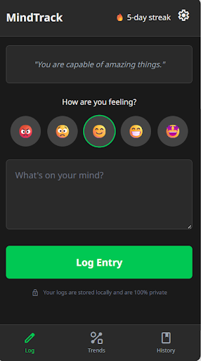
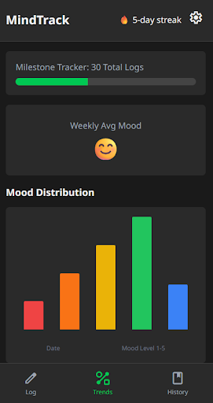
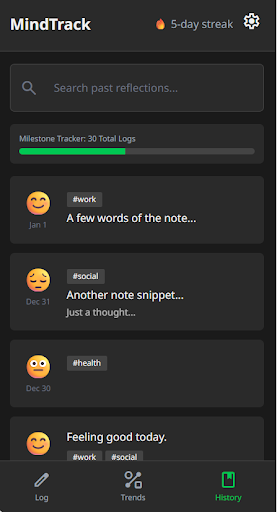

# Wireframes & Design Specs: MindTrack Wellness 🌿

This document outlines the visual architecture and user flow for the MindTrack application.

---

### 1. Mobile Check-In Interface
A high-contrast mobile check-in interface featuring a 5-point emoji mood selector, a text area for daily reflections, and a persistent streak counter to encourage consistent user engagement.

---

### 2. Analytics Dashboard
A comprehensive analytics dashboard utilizing a Chart.js line graph to visualize mood fluctuations over a 7-day period, helping users identify emotional patterns and progress at a glance.

---

### 3. Chronological Entry Archive
A chronological archive of past entries presented in scrollable cards that display the date, selected mood icon, and a preview of the user's notes for easy personal reflection.

---

### Design Color Palette
* **Primary Background:** #1A1A1A (Deep Charcoal)
* **Accent Color:** #00FFC8 (Neon Mint) — *Used for high-contrast visibility.*
* **Text:** #FFFFFF (Pure White)
