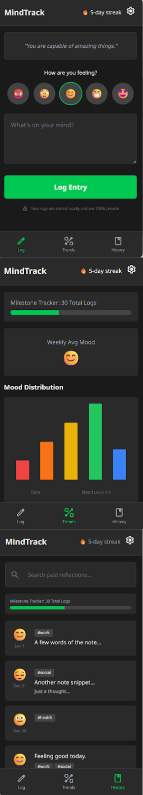
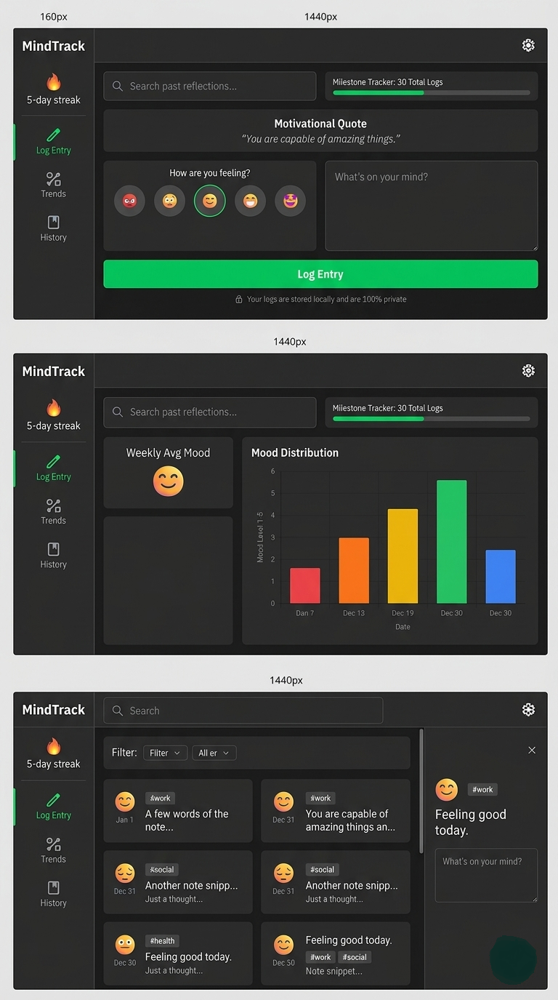

# Wireframes & Design Specs: MindTrack Wellness 🌿

This document outlines the visual architecture and user flow for the MindTrack application.

---

## 🎨 Design System & Color Palette
* **Primary Background:** #1A1A1A (Deep Charcoal)
* **Accent Color:** #00FFC8 (Neon Mint) — *Used for high-contrast visibility.*
* **Text:** #FFFFFF (Pure White)

---

## 🏗️ Visual Architecture

Below are the architectural diagrams for the MindTrack application, showcasing the full design language and responsive layouts.

### 📱 1. Mobile-First Wireframes
This diagram represents the high-contrast mobile interface.

**Key Design Concepts:**
* **Check-In:** A stacked 5-point emoji mood selector, a simplified text area for daily reflections, and a persistent flame icon streak counter to encourage user engagement.
* **Analytics Dashboard:** A comprehensive, stacked visualization utilizing a Chart.js line graph and a complementary distribution chart to quickly identify emotional patterns at a glance.
* **Archive:** A chronological list of past entries presented in scrollable cards displaying date, mood icon, and a preview of the notes for easy personal reflection.

---

### 🖥️ 2. Desktop Responsive Transformation
This diagram demonstrates how the design system adapts from mobile-first to expanded desktop views, utilizing a fixed master-navigation sidebar (160px) and Side-by-Side (Master-Detail) content panels to maximize screen real estate.

